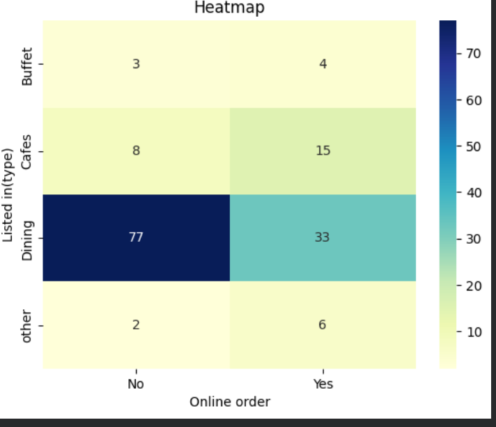
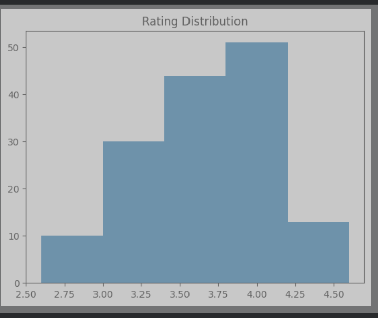

# 🍽️ Zomato Data Analysis using Python

## 📌 Project Overview

This project performs **Exploratory Data Analysis (EDA)** on the Zomato dataset to uncover insights about restaurant types, votes, ratings, and online ordering trends.

---

## 🛠️ Tech Stack

* Python 🐍
* Pandas
* NumPy
* Matplotlib
* Seaborn

---

## 📂 Dataset

* CSV dataset containing restaurant details like:

  * Name
  * Votes
  * Ratings
  * Online Order availability
  * Restaurant Type

---

## 🔍 Steps Performed

### 1️⃣ Data Loading

```python
df = pd.read_csv("Zomato-data-.csv")
df.head()
```

---

### 2️⃣ Data Cleaning

* Converted ratings from string to float

```python
def handlerate(value):
    value = str(value).split("/")
    value = value[0]
    return float(value)

df['rate'] = df['rate'].apply(handlerate)
```

---

### 3️⃣ Data Exploration

* Checked dataset structure using `.info()`
* Checked missing values

```python
df.info()
df.isnull().sum()
```

---

### 4️⃣ Data Visualization

#### 📊 Restaurant Types Distribution

```python
sns.countplot(x=df['listed_in(type)'])
```

#### 📊 Votes by Restaurant Type

```python
grouped_data = df.groupby('listed_in(type)')['votes'].sum()
plt.plot(grouped_data, marker='o')
```

#### 📊 Online Order Availability

```python
sns.countplot(x=df['online_order'])
```

#### 📊 Ratings Distribution

```python
plt.hist(df['rate'], bins=5)
```

---

### 5️⃣ Key Analysis

#### ⭐ Restaurant with Maximum Votes

```python
max_votes = df['votes'].max()
restaurant_with_max_votes = df.loc[df['votes'] == max_votes, 'name']

print("Restaurant(s) with maximum votes")
print(restaurant_with_max_votes)
```

---

## 📊 Key Insights

* 📌 Some restaurant types receive significantly more votes
* 📌 Online ordering is widely available among restaurants
* 📌 Ratings are mostly clustered in a specific range
* 📌 A few restaurants dominate in terms of popularity (votes)

---
## 📊 Visualizations

### 🔥 Heatmap (Correlation Analysis)


### 🍽️ Restaurant Type vs Votes


### ⭐ Ratings Distribution


## 🚀 How to Run

1. Clone this repository
2. Install dependencies:

   ```
   pip install pandas numpy matplotlib seaborn
   ```
3. Open the notebook in:

   * Jupyter Notebook
   * Google Colab

---

## 📈 Future Improvements

* Add interactive dashboard (Power BI / Streamlit)
* Perform sentiment analysis on reviews
* Build ML model for rating prediction

---

## 📌 Conclusion

This project demonstrates how basic data analysis and visualization techniques can extract meaningful insights from real-world datasets like Zomato.

---

## 🙌 Credits

* Dataset: Zomato
* Learning reference: GeeksforGeeks

---
